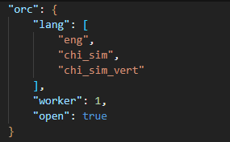
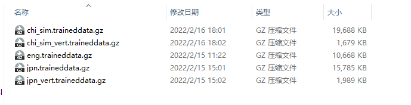
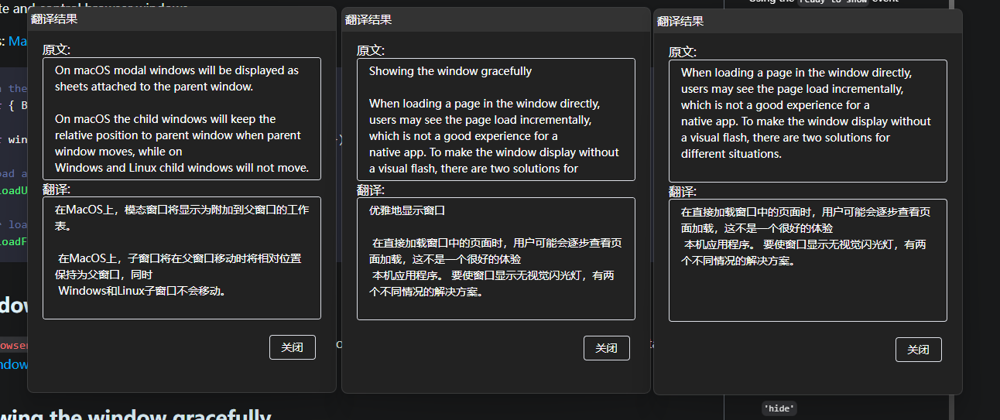
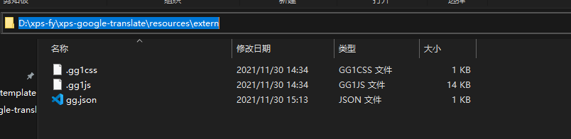
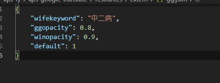

# xps-google-translation

通过注入js和css把谷歌翻译做出自己想要的样子

## 截屏翻译
默认不开启,需手动修改配置文件支持



### 配置详解

安装目录\resources\extern\gg.js 中的 orc 选项

(此外的配置都可以修改) `直接修改如果配置错误的话会导致有些功能失效,请慎重对待`

#### lang 语言包

默认是英文和中文

#### worker 识别工人数量

默认是1个,可以根据自己电脑性能进行调整,最多10个,如果配置10个以上则重置为3个

#### open 是否开启功能(默认false)

设置为false依旧可以使用截图功能


### 使用方式

1.去下载语言包([下载网站](https://github.com/naptha/tessdata/tree/gh-pages/4.0.0)),下载完成后复制到`安装目录\tesseract\langPath`下

>

2.修改配置文件lang选项,将需要支持的语言包名写入进去(chi_sim.traineddata.gz 则只写 chi_sim )

3.修改open选项为true

4.重启项目/启动项目





## 谷歌翻译源

### [谷歌翻译中国](https://translate.google.cn/?sl=auto&tl=zh-CN)

### [谷歌翻译国际](https://translate.google.com/?sl=auto&tl=zh-CN)

## 快捷键

`这些快捷键都可以在配置文件中修改`

### ctrl+e

**隐藏 显示 类似于老板键...**

### ctrl+w

**设置窗口的调起**

### ctrl+shift+e

截图翻译(orc功能关闭时只有截图功能)


## 加载失败页面


### 注意

此重启默认会切换源


## 设置页面


不设置默认进入则启动时候选择如下


### 手动设置

设置文件在安装目录的 **resources\extern** 下的gg.json





修改并重新启动就ok


#### 注意

##### .gg1css 

注入的样式

##### .gg1js

注入的js


### 图片规则

爬取的是  https://wallhaven.cc/  网站上的图片

## 内嵌功能解释

### 切换背景


### 关闭退出


### 全屏/最小化


#### click 最小化

#### double click 全屏


## 指令

```shell
//下载源码
git@github.com:mlmdflr/xps-google-translation.git

//下载依赖
yarn 

//依赖下载不动/下载失败
yarn config set electron_mirror https://cdn.npm.taobao.org/dist/electron/

//运行
yarn run dev

//打包
yarn run build:win
```


