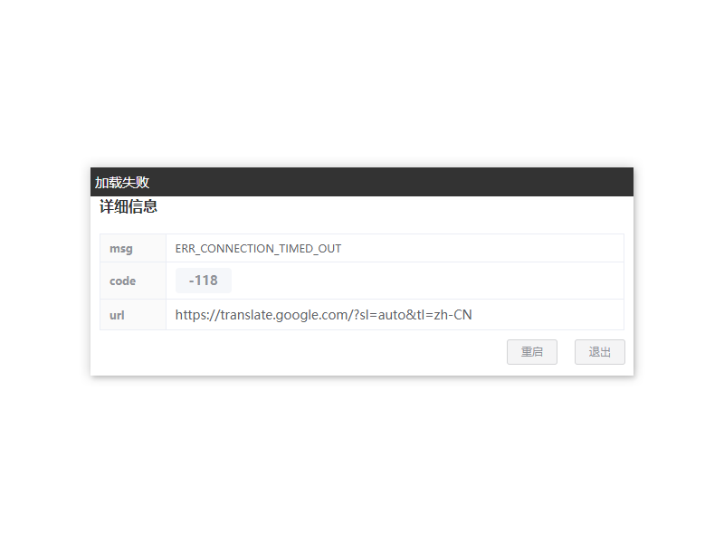
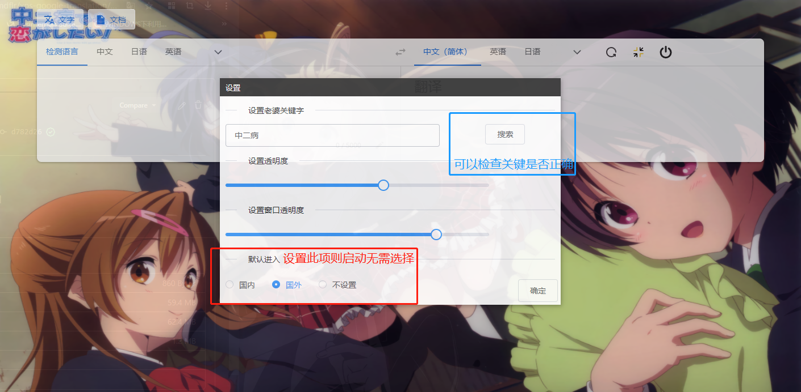
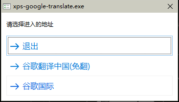
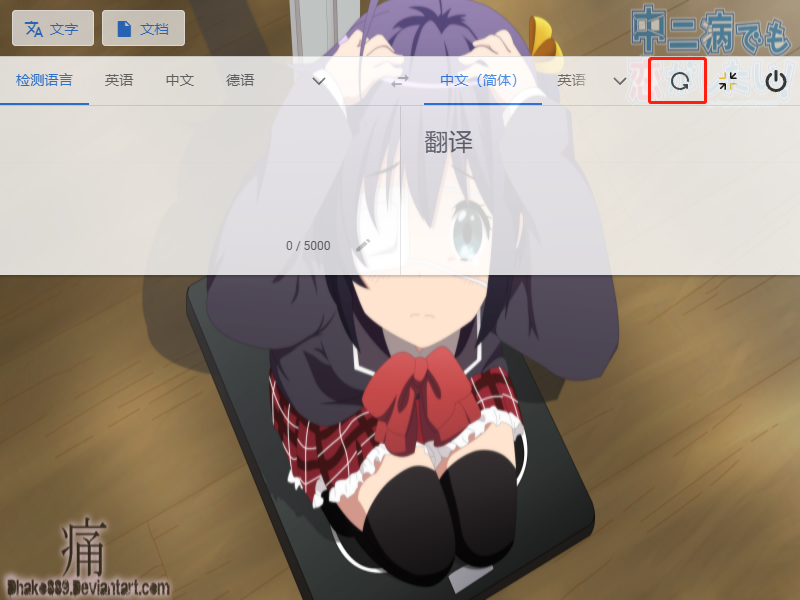
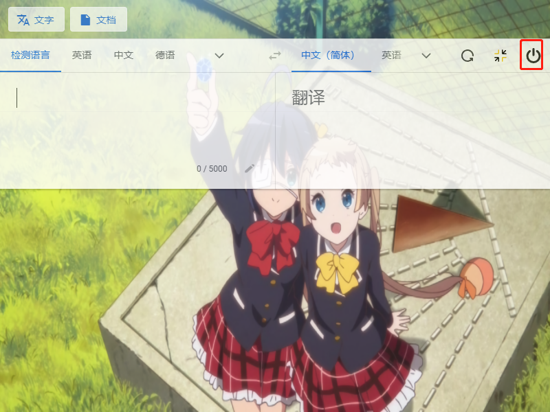
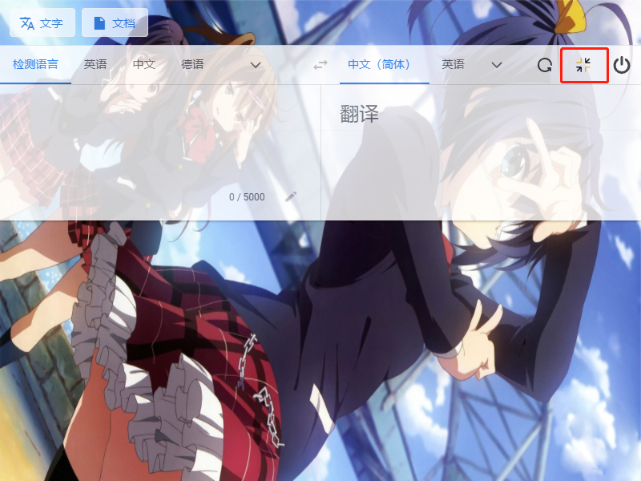

# xps-google-translation

通过注入js和css把谷歌翻译做出自己想要的样子

## 谷歌翻译源

### [谷歌翻译中国](https://translate.google.cn/?sl=auto&tl=zh-CN)

### [谷歌翻译国际](https://translate.google.com/?sl=auto&tl=zh-CN)

## 快捷键

### ctrl+e

**隐藏 显示 类似于老板键...**

### ctrl+w

**设置窗口的调起**


## 加载失败页面



### 注意

此重启默认会切换源


## 设置页面



不设置默认进入则启动时候选择如下



### 图片规则

爬取的是  https://wallhaven.cc/  网站上的图片

## 内嵌功能解释

### 切换背景



### 关闭退出



### 全屏/最小化



#### click 最小化

#### double click 全屏


## 指令

```shell
//下载源码
git@github.com:mlmdflr/xps-google-translation.git

//下载依赖
yarn 

//依赖下载不动/下载失败
yarn config set electron_mirror https://cdn.npm.taobao.org/dist/electron/

//运行
yarn run dev

//打包
yarn run build:win
```


