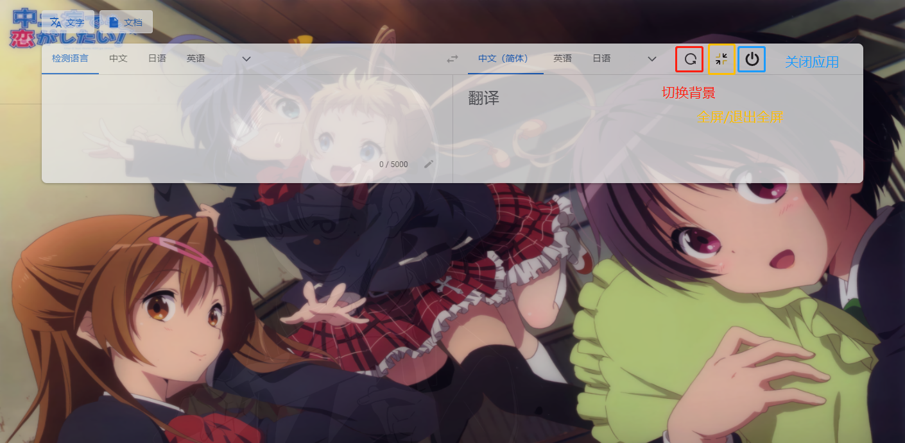

# xps-google-translation

源码地址:https://gitee.com/xp-system-enhancement-group/xps-electron-ts-vue3-template/tree/fy/

## 快捷键

### ctrl+e

**隐藏 显示 类似于老板键...**

### ctrl+w

**设置窗口的调起**

## 设置页面

不设置默认进入则启动时候选择如下

### 图片规则

爬取的是  https://wallhaven.cc/  网站上的图片

## 内嵌功能解释

## 下载

https://github.com/mlmdflr/xps-google-translation/releases/download/v3.1.0/xps-google-translate_Setup_3.1.0.exe
